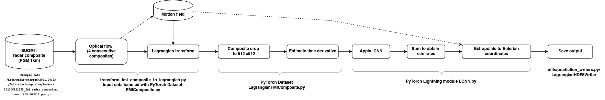

# Real-time nowcasting with the L-CNN model

This repository contains the Dockerfile and code to run the L-CNN model in real-time. For a detailed description of the model, see the [L-CNN repository](https://github.com/fmidev/lagrangian-convolutional-neural-network).

## Container

You can run the code in a container using e.g. [Docker](https://www.docker.com/). The container is specified in the [`Dockerfile`](Dockerfile) and can be built with

```bash
docker build --pull --rm -f "Dockerfile" -t lcnnrealtime:latest "."
```

## Input data

The current model checkpoint has been trained for 512 x 512 sub image of the SUOMI1 composite with 1km resolution (with filenames of format `YYYYmmddHHMM_fmi.radar.composite.lowest_FIN_SUOMI1.pgm`). The code does the sub-setting, so the user should provide paths to a directory containing the full composite images.

Also gzipped files are supported. In this case, update the `filename` to contain the `gz` suffix and `importer` to `pgm_gzip` in the `lagrangian_transform_datasets.yaml` configuration file.

Of course, if you train the model for some other dataset, you should provide the path to that dataset.

## Configurations

The scripts assume that configuration files are located in the `lcnn/config/lcnn-predict-realtime` directory.

The following parameters should be checked:

| File                                 | Parameter                      | Description                                                                                                            |
| ------------------------------------ | ------------------------------ | ---------------------------------------------------------------------------------------------------------------------- |
| `lagrangian_datasets.yaml`           | `path`                         | Path to a temporary directory allowing writing of processed data                                                       |
| `lagrangian_transform_datasets.yaml` | `path`                         | Path to input data directory                                                                                           |
| `lagrangian_transform_params.yaml`   | `output/path`                  | Path to a temporary directory allowing writing of processed data (needs to match `path` in `lagrangian_datasets.yaml`) |
| `lcnn.yaml`                          | `prediction_output/output_dir` | Path to output directory                                                                                               |
| `lcnn.yaml`                          | `prediction_output/filename`   | Output file name pattern                                                                                               |
| `lcnn.yaml`                          | `prediction_output/filter_dbz` | Minimum dBZ value, smaller values are masked away when writing output                                                  |
| `lcnn.yaml`                          | `prediction/predict_leadtimes` | Number of predicted leadtimes, assuming 5-minute intervals                                                             |

For more description of the parameters, see the [L-CNN repository](https://github.com/fmidev/lagrangian-convolutional-neural-network) readme file.

## Creating the nowcasts

The nowcasts can be created with the script `lcnn/create_nowcast.sh`:

```bash
cd lcnn
python create_nowcast.py <timestamp-YYYYmmddHHMM< lcnn-predict-realtime
```

or inside the container with `run_container_nowcast.sh`:

```bash
bash run_container_nowcast.sh
```

The configuration for this script can be overwritten by setting the environment variables `TIMESTAMP`, `CONFIG` for the nowcast parameters and `INPATH`, `OUTPATH`, `LOGPATH`, `MODELPATH` for the input, output, log and model directories mounted inside the container, respectively.

## Nowcast workflow


